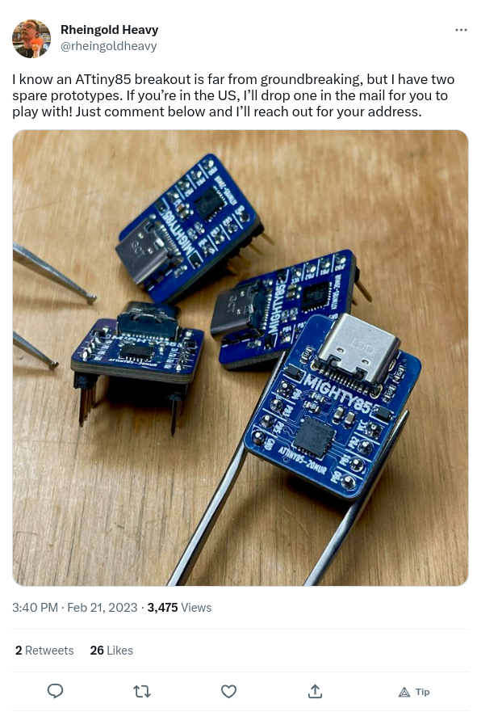
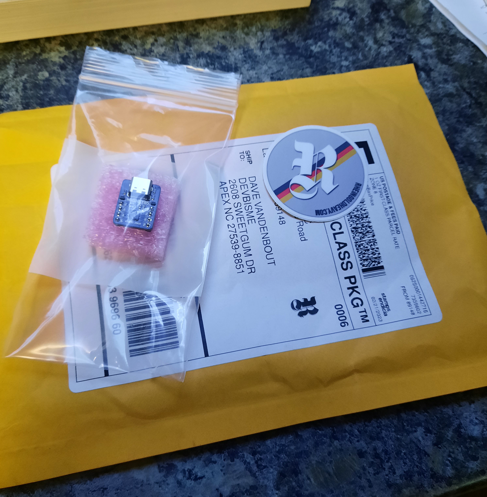
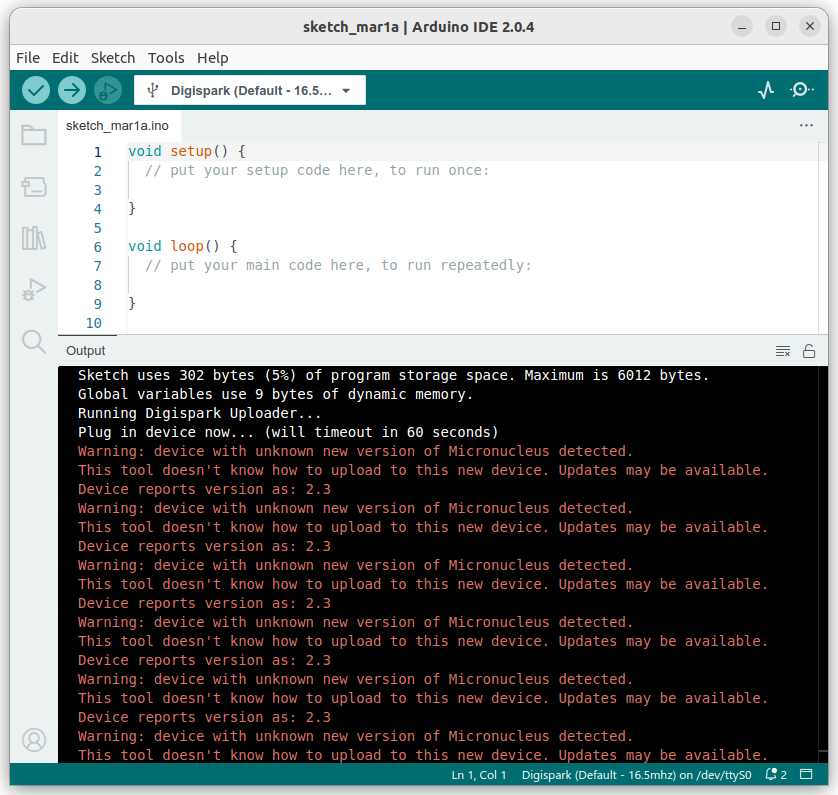
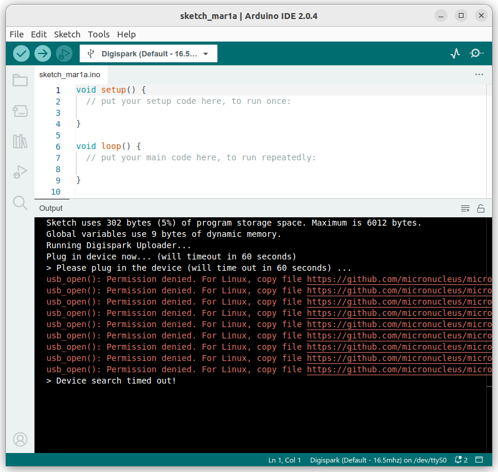
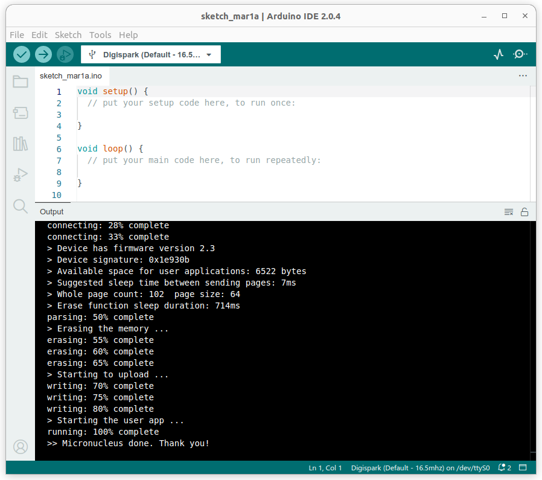
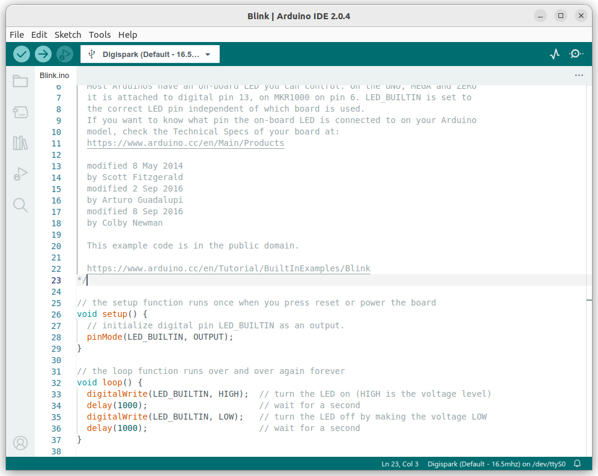
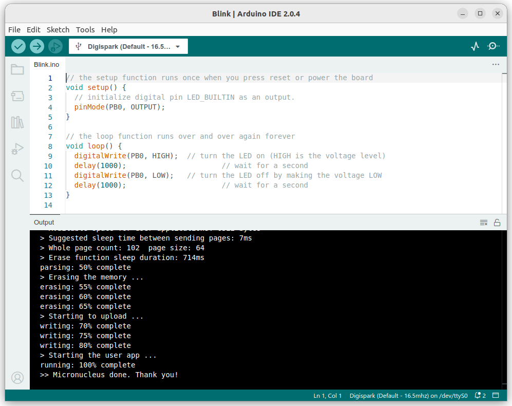

Dan Heinzsch developed an ATtiny85-based board and offered a few of them on [Twitter](https://twitter.com/rheingoldheavy/status/1628132673863700480):


After a few hours, he had only received a single reply so - since it was *free* - I went ahead and asked for one. I received it in the mail within a few days:


Before shipping, Dan asked if I needed any documentation, but I said I'd just give it a whirl and see what happens once it got here. He did helpfully let me know the ATtiny was preloaded with the Micronucleus bootloader. I had no idea what that was...

Upon receipt, I just plugged the board into a USB socket to see what would happen. I thought it might enumerate or the OS would pick it up, but ... nothing. OK, so I actually have to do a little work.

Since this was an ATtiny85 board, I figured the Arduino IDE would be a good place to start and so I downloaded the [latest appimage](https://www.arduino.cc/en/software).
Upon starting the IDE, no ATtiny boards were listed, so I added `http://digistump.com/package_digistump_index.json` to the **Additional boards manager URLs** field in **File/Preferences** as described [here](https://koen.vervloesem.eu/blog/how-to-use-the-digispark-with-micronucleus-bootloader-in-the-arduino-ide/).
After the IDE installed the board package, I selected `Digispark (Default - 16.5 MHz)` from the list presented by **Tools/Boards**.
I also set **Tools/Port** to `/dev/ttyS0`. (I'm using Ubuntu 22.04.)

With the Mighty85 disconnected from the USB port, I attempted to compile & upload the default empty program in the IDE.
When prompted, I reattached the board and then got pummeled with these messages:


While Dan helpfully had loaded the Micronucleus bootloader, he used a version (2.3) that is newer than the `digistump` board package can handle.
So I had to compile a new micronucleus executable as discussed [here](https://koen.vervloesem.eu/blog/how-to-upgrade-the-micronucleus-bootloader-on-the-digispark/):
```bash
git clone https://github.com/micronucleus/micronucleus.git
cd micronucleus/commandline
sudo apt install libusb-dev
make
sudo make install
```

Next, I copied over the old executable in the board package with my newly-compiled `micronucleus`:
```bash
cp /usr/local/bin/micronucleus ~/.arduino15/packages/digistump/tools/micronucleus/2.0a4
```

After this, my compile & upload got a little further but still had a problem:


The error message (most of which you can't see) told me that I couldn't use the USB port to access the Mighty85 until I added some rules:

```bash
sudo cp 49-micronucleus.rules /etc/udev/rules.d
```

With the rules in place, the upload succeeded:


Empty loops are fun and all, but a real program is needed that shows the Mighty85 is actually working.
I started with the **File/Examples/01.Basics/Blink** example that blinks an LED on and off in a two-second cycle.



Since the Mighty85 doesn't have a built-in LED, I decided to use an LED + resistor connected between the I/O pin labeled `PB0` and ground.
I didn't know the actual pin number or register address of `PB0` but the Arduino environment does.
All I had to do was replace `LED_BUILTIN` with `PB0`.



After compiling and uploading, I had a blinking LED:


<video controls>
  <source src="images/blink.mp4" type="video/mp4">
</video>

That's it for now!